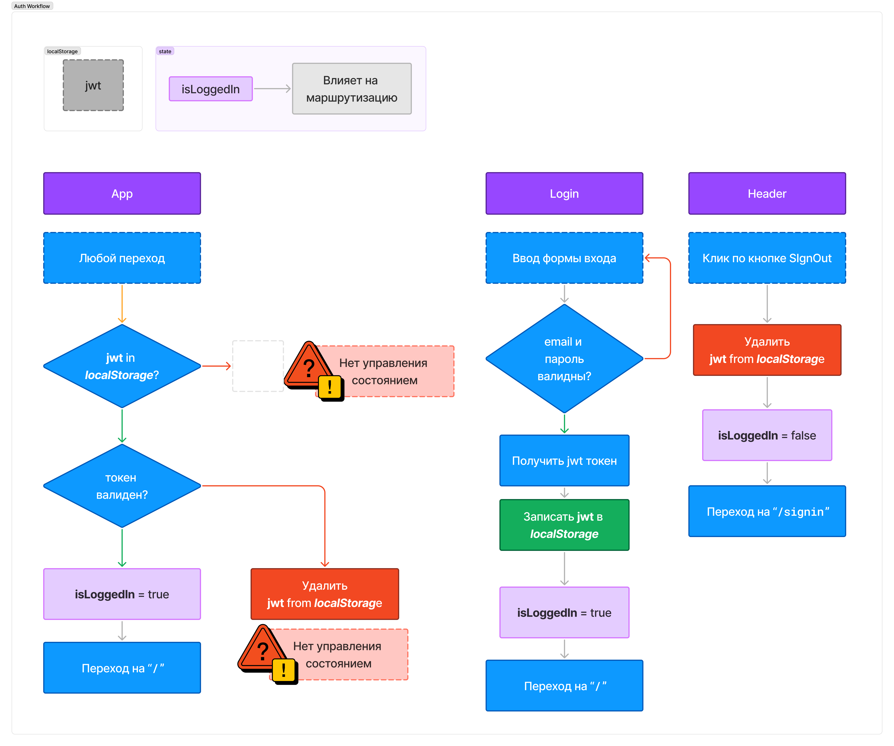
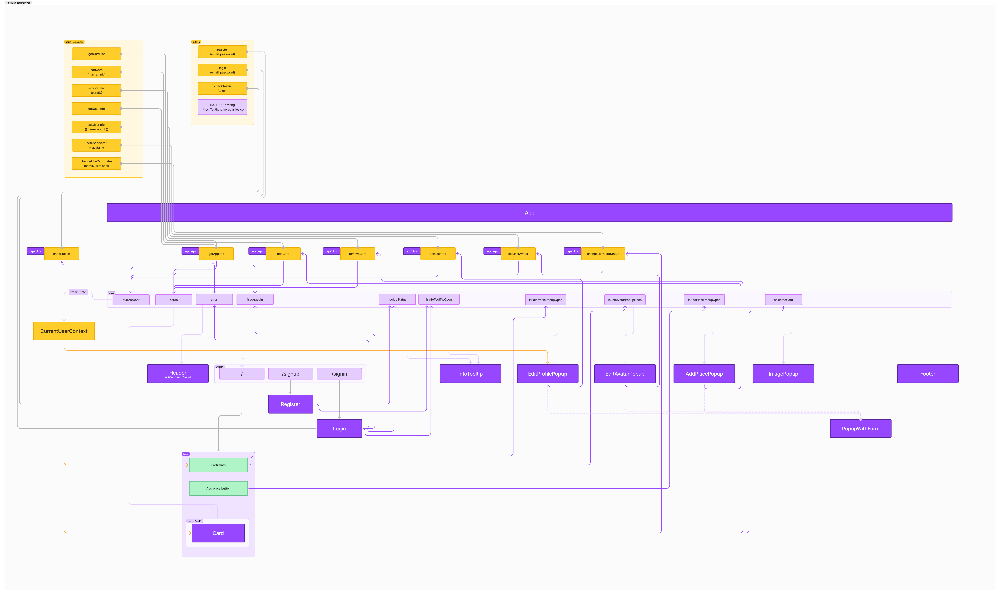
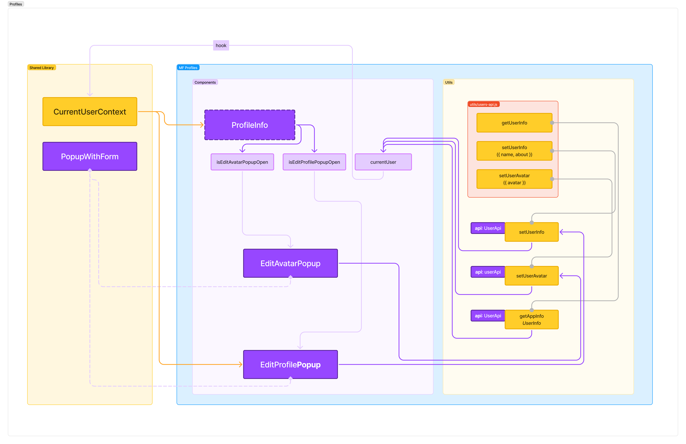
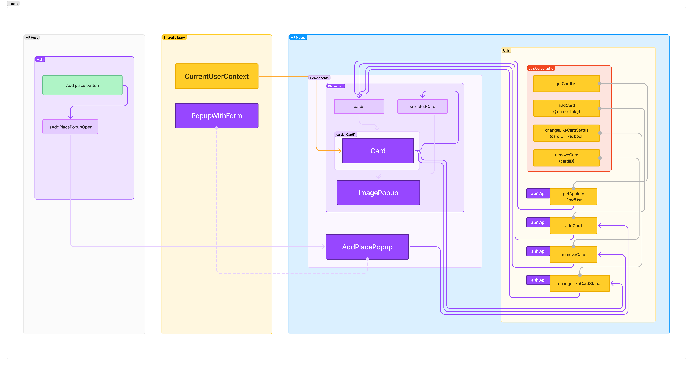
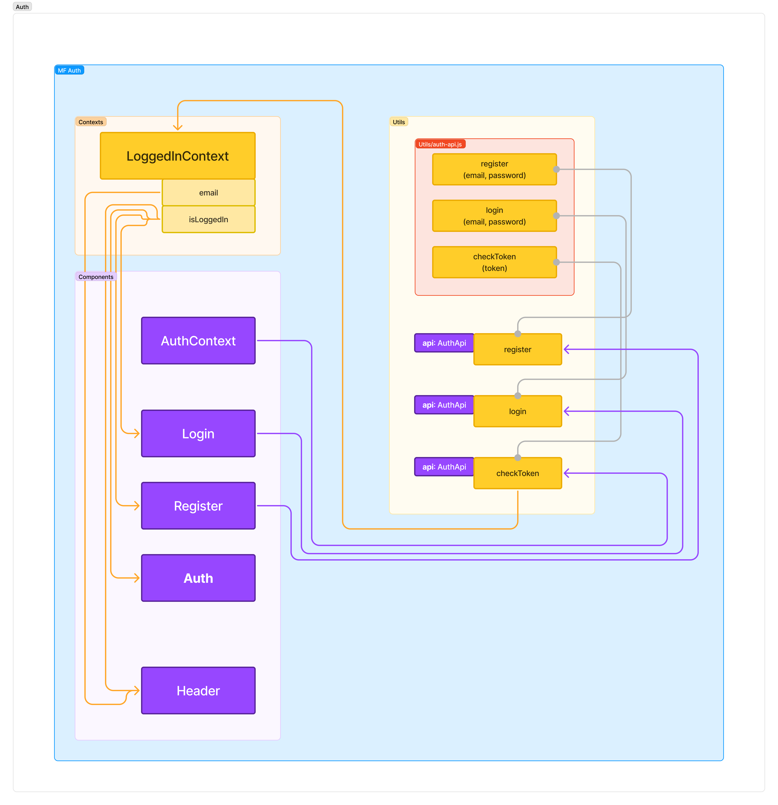
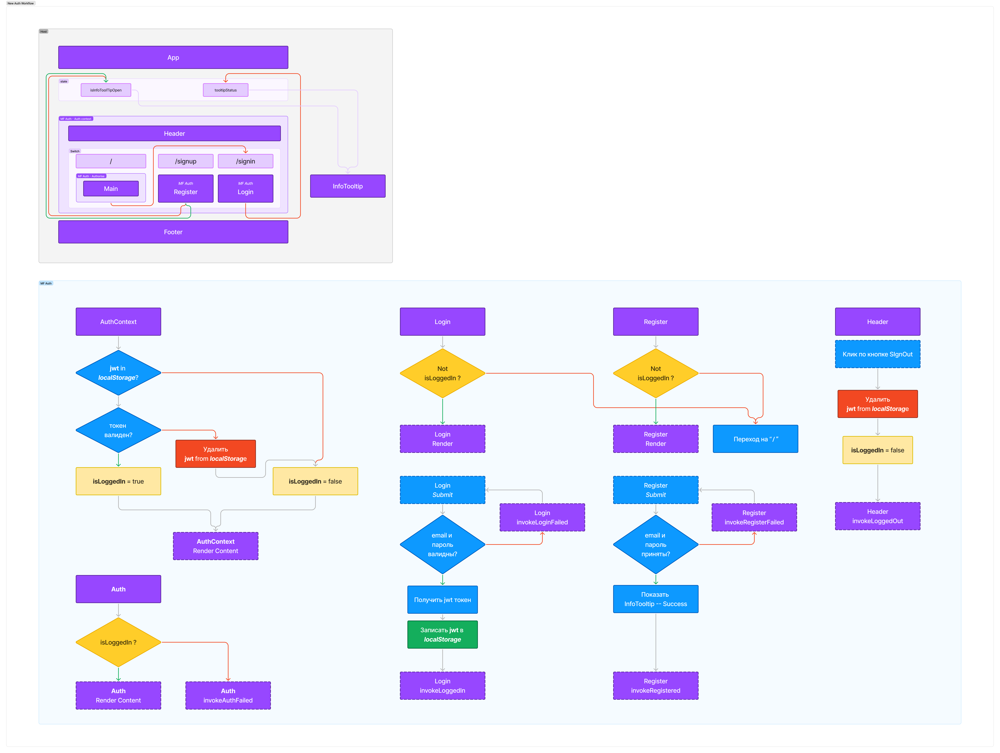
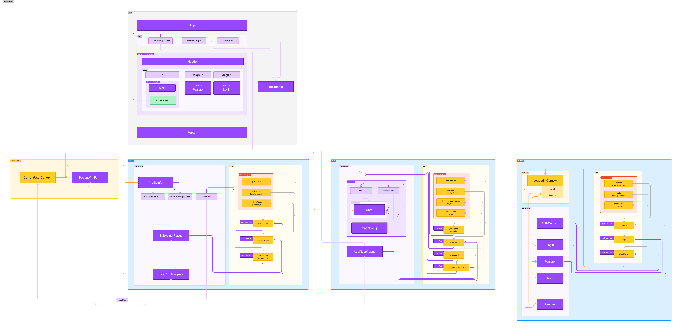

# Оглавление
- [Аудит текущего состояния проекта](#аудит-текущего-состояния-проекта)
  - [Файлы](#файлы)
  - [Перечень end-point-ов на бэке в репозитории](#перечень-end-point-ов-на-бэке-в-репозитории)
  - [Распределение end-point-ов по файлам каталога `utils`](#распределение-end-point-ов-по-файлам-каталога-utils)
  - [Имеющиеся сущности в монго-свалке](#имеющиеся-сущности-в-монго-свалке)
  - [Перечень react-компонент](#перечень-react-компонент)
  - [Workflow аутентификации на фронте](#workflow-аутентификации-на-фронте)
  - [Выявленные проблемы текущей конфигурации](#выявленные-проблемы-текущей-конфигурации)
- [Разделение на микрофронты](#разделение-на-микрофронты)
  - [Выбор фреймворка](#выбор-фреймворка)
  - [Схема созависимостей](#схема-созависимостей)
  - [Разбор на части](#разбор-на-части)
    - [Profiles](#profiles)
      - [Компоненты](#компоненты)
      - [Зависимости](#зависимости)
      - [Взаимодействие с backend-ом](#взаимодействие-с-backend-ом)
    - [Places](#places)
      - [Компоненты](#компоненты-1)
      - [Взаимодействие с backend-ом](#взаимодействие-с-backend-ом-1)    
    - [Auth](#auth)
      - [Компоненты](#компоненты-2)
      - [Новый workflow аутентификации](#новый-workflow-аутентификации)
      - [Взаимодействие с backend-ом](#взаимодействие-с-backend-ом-2)
    - [Общая схема всех микрофронтов](#общая-схема-всех-микрофронтов)
- [Нюансы реализации](#нюансы-реализации)

# Аудит текущего состояния проекта
## Файлы
```
├── backend/                # папка с api, это по заданию разбирать не надо
├── frontend/               # 
    ├── src/                # Исходники
        ├── blocks/         # БЭМ стили. Структура папок соответствует структуре классов
        ├── components/     # Все react-компоненты проекта. Вообще все. Про компоненты подробнее ниже
        ├── contexts/       # Для общих контекстов
            ├── CurrentUserContext.js # Контекст для данных по пользователям
        ├── images/         # ассеты в форме картинок
        ├── utils/          # набор функций и классов для общения с сервером
            ├── api.js      # класс api с методами работы с контентом, а также расшаренный инстанс этого класса аля singleton с захаркожеными параметрами для адреса `nomoreparties.co`
            ├── auth.js     # набор функций для регистрации, аутентификации и валидации токена. Также захардкожен в константу адрес `auth.nomoreparties.co`
        ├── vendor/         # ассеты в форме шрифтов и браузерной амортизации стилей   
        ├── index.css       # Подключение всех узловых css-файлов с каскадными стилями
        ├── index.js        # Точка входа для исполнение приложения
        ├── logo.svg        # ассет в форме векторного логотипа
        ├── serviceWorker.js# старый кусок core web vitals, след того что проект развернут из шаблонов create-react-app
        ├── setupTests.js   # [Tests] setup для jest unit-тестов, их тут нет
    ├── index.spec.js       # [Tests] Тесты, кажется единственные
    └── package.json        # Основные зависимости
... 
├── compose.yaml            # конфиг для запуска всего проекта в докере
...
└── README.md               # Мы здесь
```

## Перечень end-point-ов на бэке в репозитории
- post `{api_url}/signin`
- post `{api_url}/signup`

- get `{api_url}/users`
	- get `{api_url}/users/:id`
	- get `{api_url}/users/me`
	- patch `{api_url}/users/me`
		- patch `{api_url}/users/me/avatar`

- get `{api_url}/cards`
	- post `{api_url}/cards`
	- delete `{api_url}/cards/:id`
		- put `{api_url}/cards:id/likes`
		- delete `{api_url}/cards:id/likes`

## Распределение end-point-ов по файлам каталога `utils`
### api.js
- get `cards`
- post `cards`
- delete `cards/:id`
- put `cards:id/likes`
- delete `cards:id/likes`
- get `users/me`
- patch `users/me`
- patch `users/me/avatar`


### auth.js
- post `signin`
- post `signup`
- get `users/me`

### Не задействованные
- get `users`
- get `users/:id`


## Имеющиеся сущности в монго-свалке

- `Cards`
	- indexes
		- id (uniq)
- `Users`
	- indexes
		- id (uniq)
		- email (uniq)


## Перечень react-компонент
- `App` - корневой компонент приложения
    ```
    ├── .../blocks
        └── page/__content          # стиль для контент контейнера
    ├── .../components/
        └── app.js                  # Код компоненты
    ```
- `Header` - шапка сайта
    ```
    ├── .../blocks
        ├── header/                 # внутри все стили для header компоненты
        └── page/__section          # сетка
    ├── .../components/
        └── header.js               # Код компоненты
    ```
- `Register` - форма регистрации **пользователя**
    ```
    ├── .../blocks
        └── auth-form/              # внутри все стили для register компоненты 
    ├── .../components/
        └── Register.js             # Код компоненты
    ```
- `Login` - форма входа **пользователя**
    ```
    ├── .../blocks
        └── page/__content          # стиль для контент контейнера 
    ├── .../components/
        └── Login.js                # Код компоненты
    ```
- `Main` - аккумулятор контента для главной страницы приложения
    ```
    ├── .../blocks
        ├── profile/                # стили для несуществующей компоненты `profile`
        ├── places/__list           # стили раздела с карточками **мест**
        └── page/__section          # сетка
    ├── .../components/
        └── Main.js                 # Код компоненты
    ```
- `Card` - компонента карточки **места**
    ```
    ├── .../blocks
        ├── card/                   # стили компоненты Card
        └── places/__item           # стили элемента-карточки **места**
    ├── .../components/
        └── Card.js                 # Код компоненты
    ```
- `InfoTooltip` - всплывашка о успешной/не успешной **регистрации**
    ```
    ├── .../blocks
        └── popup/                  # стили всплывашки
    ├── .../components/
        └── InfoTooltip.js          # Код компоненты
    ```
- `EditProfilePopup` - Всплывашка с формой для редактирования **профиля**
    ```
    ├── .../blocks
        └── popup/                  # стили всплывашки
    ├── .../components/
        └── EditProfilePopup.js     # Код компоненты
    ```
- `EditAvatarPopup` - Всплывашка с формой для редактирования ссылки на аватар профиля
    ```
    ├── .../blocks
        └── popup/                  # стили всплывашки
    ├── .../components/
        └── EditAvatarPopup.js      # Код компоненты
    ```
- `AddPlacePopup` - Всплывашка с формой заведения карточки **места**
    ```
    ├── .../blocks
        └── popup/                  # стили всплывашки
    ├── .../components/
        └── AddPlacePopup.js        # Код компоненты
    ```
- `ImagePopup` - Всплывашка для просмотра карточка **места**
    ```
    ├── .../blocks
        └── popup/                  # стили всплывашки
    ├── .../components/
        └── ImagePopup.js           # Код компоненты
    ```
- `PopupWithForm` - Компонента - обертка для функционала всплывашки и html формы
    ```
    ├── .../blocks
        └── popup/                  # стили всплывашки
    ├── .../components/
        └── PopupWithForm.js        # Код компоненты
    ```
- `Footer` - Подвал сайта со статикой
    ```
    ├── .../blocks
        ├── footer/                 # Стили для компоненты Footer
        └── page/__section          # сетка
    ├── .../components/
        └── Footer.js               # Код компоненты
    ```

## Workflow аутентификации на фронте



В текущем состоянии есть 2 ответвления которые приведут к тупику работы приложения. 

Первый при отрицательном исходе проверки наличия jwt токена в localStorage. Ситуация может и редкая, но раз мы делим на микрофронты, то стоит защититься от полной очистки хранилища любой из команд remote фронтов. Оставить как есть не можем.

Второй при проверке актуальности токена. Мы, конечно, изучив токен знаем, что там только ИД объекта пользователя из монго свалки. Но работа бэкенда для фронта это все таки черный ящик и не его зона ответственности. Полноценный pipeline для **oauth** тут бы задействовал `refresh_token`. Но у нас из обновления токена в наличии лишь полный login, а потому добавим в эту ветвь логики переадресацию на signin.

## Выявленные проблемы текущей конфигурации
- С backend разбираться не надо. Отмечу только, что есть косяк с мидлварей `auth`,  которая блокирует end point `signin`. А также в compose не хватает проброса портов, чтобы полазить по монгосвалке поресерчить что туда заносится. Эти моменты поправил в []() и [](), соответственно
- В проекте по сути 3 бэк среды
    1. `nomoreparties.co/cohort0` - не умеет в аутентификацию из проекта. Контент рандомен и статичен. логика описанная в папке `backend` не соответствует. Для отладки и проверки работы по тз не рекомендуется
    2. `auth.nomoreparties.co` - полностью соответствует логике описанной в папке `backend`. Корректно работает с аутентификацией.
    3. Папка `backend`, докер файл и compose. Ну по сути среда в докере. Хотелось бы сказать что логика соответствует самой себе, но есть ошибка с `auth`, описанная выше.
  По сути из трех сред полнофункциональная для работы только вторая. Но третья требует совсем мелкой корректировки чтобы соответствовать второй. 
  
  В проекте захардкожены прямо в коде первые 2 среды. Причем регистрация и аутентификация работает со второй средой, а вот подгрузка контента с первой при этом авторизация по сути происходит на стороне клиента по признаку наличия или отсутствия значения в `localStorage`

  Думаю сделаем две `.env` конфигурации соответствующие второй и третьей среде, хардкод перепишем.
- есть разметка `profile` внутри компоненты `main`, но нет соответствующей ей компоненты. Ее провайдер и рендер берет на себя аккумулятор `main`. При разделении доменов это может быть потенциальной точкой разделения и оформления `profile` в компоненту.
- Есть компонента `PopupWithForm` выполняющую роль всплывашки и корня формы отправки данных. Она используется в ряде форм. По хорошему для гибкости использования форм других контекстах и разделения на домены стоило бы отделить компоненты форм от компоненты всплывашки и объединять их только непосредственно на экранах где они используются. Но задача состоит в разделении на микрофронты текущей реализации, поэтому `PopupWithForm` кандидат на содержимое общей **shared library**. 
- `CurrentUserContext` - выступает в роли глобального состояния. В целом действие для него одно, а состояний 2, использование контекста оправдано, менеджер глобального состояния тут ни к чему. Единственное им будут пользоваться потенциального более одного микрофронта, а потому это кандидат на содержимое общей **shared library**.

# Разделение на микрофронты
## Выбор фреймворка
Текущий код использует React 17. Ограничений ни для SingleSPA ни для сборщика WebPack 5-ой версии это не ставит. Потребности в одновременном использовании нескольких разных библиотек/фреймворков в проекте не видно. А также смею предположить, что компетенции по сборщику webpack куда больше распространены на рынке, чем singleSPA. И singleSPA требует для себя отдельные плагины под каждый вид библиотеки и фреймворка. Так что SingleSPA несет с собой больше усложнений, увеличение узлов тоже в большем количестве, чем у Module Federation, а значит увеличивает хрупкость. При этом в контексте данного кода бонусов в сравнении с Webpack MF не дает.

Результат: Останавливаемся на Webpack Module Federation
## Схема созависимостей



## Разбор на части
Начнем распутывать схему так, чтобы получились группы максимально не связанные друг с другом. Выше у нас уже были определены 2 потенциальных кандидата на выход в общую библиотеку, поэтому связями с ними будем пренебрегать.

Разнеся по кучкам у нас получится 3 группки + host-приложение + общая библиотека. У групп есть явные общие признаки и они доменные. ТЗ на функционал у нас есть, потому исходим из существующего кода, а значит логику деления фиксируем **доменную**. Итого получаем 3 домена
- `Profiles` - Профиль пользователя и работа с ним
- `Places` - Места и работа с ними
- `Auth` - Учетные данные пользователя и работа с ними

### Profiles



#### Компоненты
У нас есть 3 состояния (`isEditAvatarPopupOpen`, `isEditProfilePopupOpen`, `currentUser`) из корневой компоненты App которые всецело попали в этот домен. 2 компоненты всплывашки (`EditAvatarPopup`, `EditProfilePopup`) и бескомпонентный блок `ProfileInfo` который имеет собственные стили и триггеры для изменения состояний от которых зависят всплывашки. Нам следует оформить этот блок компоненту и приютить у него все три состояния.
Итого получаем 3 компоненты
- `ProfileInfo`
- `EditAvatarPopup` 
- `EditProfilePopup` 

#### Зависимости
От общей библиотеки возьмем
- Общий контекст пользователя `CurrentUserContext`
- Компоненту `PopupWithForm`

Надо при этом учесть, что изменение состояния currentUser воздействует на контекст. Стоит прокинуть хук в общей библиотеке.

#### Взаимодействие с backend-ом
Нам нужны 3 метода класса `Api`
- `getUserInfo()` (get `users/me`) _(Было спрятано в `getAppInfo`, в этом домене потребности в обоих запросах нету)_
- `setUserAvatar({ avatar })` (patch `users/me/avatar`)
- `setUserInfo({ name, about })` (patch `users/me`) 
Выделим их в класс `UserApi`. Для экземпляра класса оставим тот же подход что и в оригинале, то есть инициализируем и расшарим на всех, только данные инициализации подтянем из dotEnv, чтобы не было хардкода по линии магии.

#### Структура файлов

```
├── envs
    ├── .env.docker
    └── .env.nomoreparties
├── src/
    ├── assets/
        ├── images
            ├── add-icon.svg
            ├── edit-icon.svg
        └── styles/
            ├── page/
                ...
            └── profile/
                ...
    ├── components/
        ├── ProfileInfo/
            ├── component.jsx
            ├── index.js
            └── styles.css
        ├── EditAvatarPopup/
            ├── component.jsx
            ├── index.js
            └── styles.css        
        └── EditProfilePopup/
            ├── component.jsx
            ├── index.js
            └── styles.css
    ├── utils/
        └── users-api.js
    ├── App.jsx
    ├── index.css
    ├── index.html
    └── index.js
├── .babelrc
├── .gitignore
├── compilation.config.js
├── Dockerfile
├── package.json
└── webpack.config.js
```

### Places



#### Компоненты
Через группировку связанных элементов в данный домен попали компоненты `Card` вместе с map-ингом массива `cards`, `ImagePopup` и `AddPlacePopup`. При этом кнопка которая меняет состояние отображения компоненты, вместе с самим состоянием остались в хост-приложении. Состояния от которых зависят компоненты: `cards` и `selectedCards`. Эта парочка вместе с отдельными стилями `places` намекают что нам нужна корневая компонента `PlacesList`, которая всех их объединит.

#### Взаимодействие с backend-ом
Нам нужны 3 метода класса `Api`
- `getCardList()` (get `cards`) _(Было спрятано в `getAppInfo`, в этом домене потребности в обоих запросах нету)_
- `addCard({ name, link })` (post `cards`)
- `removeCard(cardID)` (delete `cards/:id`) 
- `changeLikeCardStatus(cardID, like: bool)` (put `cards:id/likes` или delete `cards:id/likes`) 

Выделим их в класс `CardsApi`. Для экземпляра класса оставим тот же подход что и в оригинале, то есть инициализируем и расшарим на всех, только данные инициализации подтянем из dotEnv.

#### Структура файлов

```
├── envs
    ├── .env.docker
    └── .env.nomoreparties
├── src/
    ├── assets/
        ├── images/
            ├── delete-icon.svg
            ├── like-active.svg
            └── like-inactive.svg
        └── styles/
            ├── card/
                ...
            ├── page/
                ...
            ├── places/
                ...
            └── popup/
                ...
    ├── components/
        └── AddPlacePopup/
            ├── component.jsx
            ├── index.js
            └── styles.css
        ├── Card/
            ├── component.jsx
            ├── index.js
            └── styles.css
        ├── ImagePopup/
            ├── component.jsx
            ├── index.js
            └── styles.css        
        ├── PlacesList/
            ├── component.jsx
            ├── index.js
            └── styles.css
    ├── utils/
        └── cards-api.js
    ├── App.jsx
    ├── index.css
    ├── index.html
    └── index.js
├── .babelrc
├── .gitignore
├── compilation.config.js
├── Dockerfile
├── package.json
└── webpack.config.js
```

### Auth

Внешних зависимостей получилось избежать, все общение с другими происходит через вложенность или обработчики событий. 



#### Компоненты
При разборе в домен `Auth` признакам взаимосвязей состояний и методов работы api попало 4 компоненты: `Login`, `Register`, `Header`, `ProtectedRoute`. Также для инкапсуляции функционала домена мы заводем новую компоненту `AuthContext`. Состояния которые требуется для компонент домена - это `isLoggedIn` и `email`. Для доступа объявим их контекстом `LoggedInContext` и передадим управление им компоненте `AuthContext`. Компонента же `ProtectedRoute` будет получать значение именно из контекста, а не из props-ов.


#### Новый workflow аутентификации
Состояние аутентификации у нас строится на значения состояния `isLoggedIn` и наличия( или отсутствия ) `jwt`-токена в `localStorage`. Для инкапсуляции всей логики аутентификации создадим компоненту обертку `AuthContext` которая задаст контекст для состояния `isLoggedIn` с которым будут уметь работать остальные компоненты домена. А компоненту обертку `ProtectedRoute` научим работать с контекстом.

Чтобы маршрутизация осталась в зоне ответственности хост приложения мы в компонентах домена auth оставим (сделаем) event handler'ы на события
- `AuthFailed`
- `LoggedIn`
- `LoginFailed`
- `Registered`
- `RegisterFailed`
- `LoggedOut`



#### Взаимодействие с backend-ом
Нам нужны 3 метода класса `Api`
- `register(email, password)` (post `signup`)
- `login(email, password)` (post `signin`)
- `checkToken(token)` (get `users/me`) 

В оригинале у нас просто функции с константой параметрами. Но есть подозрение что так вышло стихийно из-за разделения на 2 разных backend среды при подготовке репозитория примера. Думаю стоит прибегнуть к принципу единообразия и повторить тот же подход, что и в остальных микрофронтах.

Выделим методы в класс `AuthApi`. Инициализируем экземпляр взяв параметры для из dotEnv. Расшарим экземпляр на всех. 

#### Структура файлов

```
├── envs
    ├── .env.docker
    └── .env.nomoreparties
├── src/
    ├── assets/
        ├── images/
            └── logo.svg
        └── styles/
            ├── auth-form/
                ...
            ├── header/
                ...
            ├── login/
                ...
            └── page/
                ...
    ├── components/
        ├── AuthContext/
            ├── component.jsx
            ├── index.js
            └── styles.css
        ├── Header/
            ├── component.jsx
            ├── index.js
            └── styles.css
        ├── ProtectedRoute/
            ├── component.jsx
            ├── index.js
            └── styles.css        
        └── Login/
            ├── component.jsx
            ├── index.js
            └── styles.css
        └── Register/
            ├── component.jsx
            ├── index.js
            └── styles.css            
    ├── contexts/
        logged-in-context.js           
    ├── utils/
        └── auth-api.js
    ├── App.jsx
    ├── index.css
    ├── index.html
    └── index.js
├── .babelrc
├── .gitignore
├── compilation.config.js
├── Dockerfile
├── package.json
└── webpack.config.js
```


### Host-приложение
В основном приложении осталось только 3 части состояния: `isAddPlacePopupOpen`,`isInfoToolTipOpen`,`tooltipStatus`. 

Перечень же компонент:
- `App`
- `Main`
- `InfoTooltip`
- `Footer`

#### Структура файлов

```
├── src/
    ├── assets/
        ├── images
            ├── error-icon.svg
            └── success-icon.svg
        └── styles/
            ├── content/
                ...
            ├── footer/
                ...
            └── page/
                ...
    ├── components/
        ├── Footer/
            ├── component.jsx
            ├── index.js
            └── styles.css        
        └── InfoTooltip/
            ├── component.jsx
            ├── index.js
            └── styles.css
        └── Main/
            ├── component.jsx
            ├── index.js
            └── styles.css
    ├── remote-components/
        ├── mf-auth/
            ├── auth-context.jsx
            ├── header.jsx
            ├── login.jsx
            ├── protected-route.jsx
            └── register.jsx
        ├── mf-places/
            ├── add-place-popup.jsx
            └── places-list.jsx
        └── mf-profiles/
            └── profile-info.jsx
    ├── App.jsx
    ├── index.css
    ├── index.html
    └── index.js
├── .babelrc
├── .gitignore
├── compilation.config.js
├── Dockerfile
├── package.json
└── webpack.config.js
```

### Shared Library

#### Структура файлов

```
├── src/
    ├── assets
        ├── images/
            └── close.svg
        └── styles/
            └── popup/
                ...
    ├── components
        └── popup-with-form
            ├── component.jsx
            ├── index.js
            └── styles.css            
    └── contexts
        └── current-user-global-ctx.js
├── .gitignore
├── compilation.config.js
└── package.json    
```

### Общая схема всех микрофронтов


#### Структура файлов

```
...
├── new-frontend/
    ├── host/
        ...
    ├── remotes/
        ├── mf-auth/
            ...
        ├── mf-places/
            ...
        └── mf-profiles/
            ...
    └── share/
        └── common-library/
            ...
├── compose.docker.yaml
├── compose.nomoreparties.yaml
...
```

# Нюансы реализации

Перед работой провел краткое исследование в форме простенького mvp для выяснения нюансов работы с webpack module federation. Была выявлена проблема сборки при наличии общих библиотек. WebPack судя по всему когда делит на чанки по-умолчанию использует формулу `[id].[bundleFileName].js`. Симптомы проблемы: общая библиотека режется на чанки с одинаковыми id. Из-за чего получаем ошибку `ERROR in Conflict: Multiple assets emit different content to the same filename 112.bundle.js`. 

Проблему удалось локализовать. Чтобы воспроизвести её общая библиотека должна иметь собственные зависимости от других библиотек npm. По всей видимости нарезка на чанки работает рекурсивно по флагам в коде типа наличия лицензий, например. А вот id прокручивается итеративно линейно в хост микрофронте.

Соответственно чтобы решить проблему нужно либо отключить нарезку либо переопределить формулу имени файлов, например добавив хеш по наполнению файла. Я выбрал второе. В теории это замедлит сборку, но у нас не того размера код, чтобы об этом сейчас волноваться.
